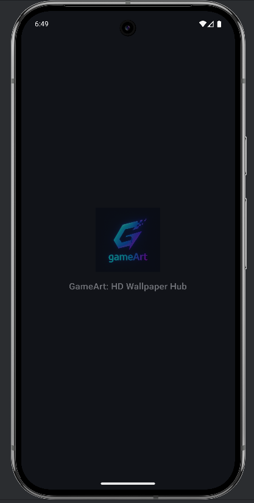
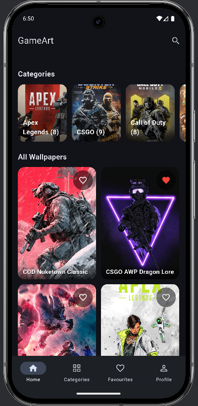
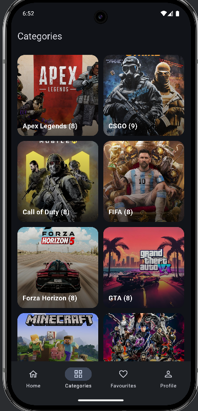
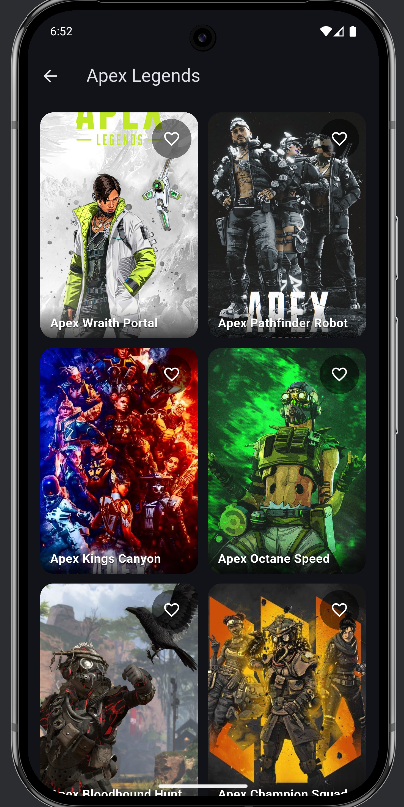
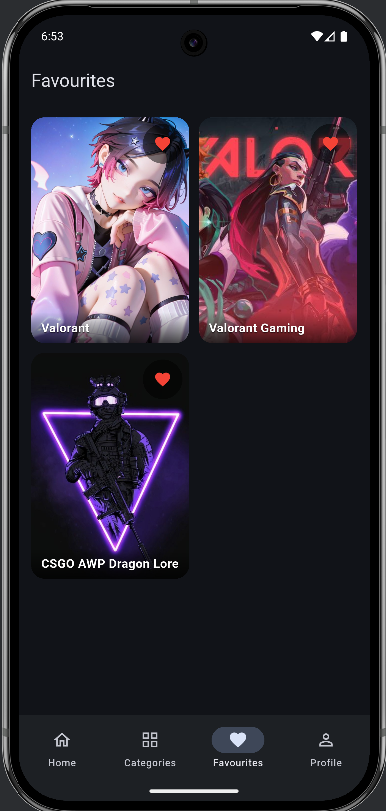
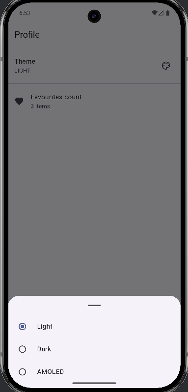
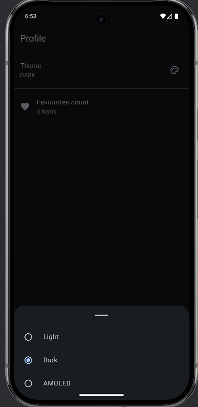
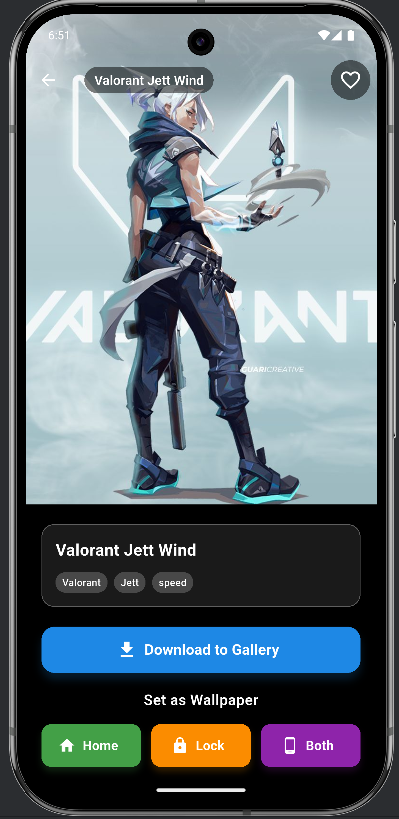
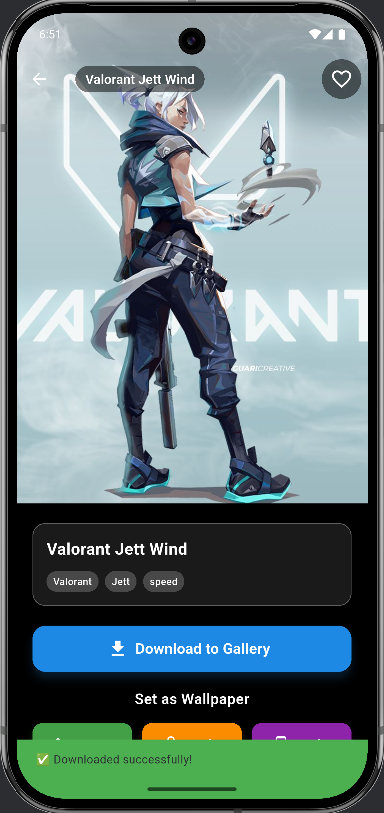

# gameart

A new Flutter project.

## Getting Started

# 🎮 GameArt

GameArt is a Flutter app that provides **HD gaming wallpapers** for mobile devices.  
Users can explore categories, search wallpapers, and set them as home/lock screen backgrounds , change theme to light , dark and amoled.with add to favourite button which whill show in favourite page

---

## 🚀 Features
- 🔍 Search wallpapers by game or category  
- 🖼️ High-quality HD wallpapers  
- 📲 Set wallpapers for **home screen**, **lock screen**, or both  
- ⚡ Fast image loading 

---

## 🛠️ Tech Stack
- **Flutter** (Dart)  
- **Firebase** (for storing wallpapers & categories)  
- **Cached Network Image** for image caching  
- **Wallpaper Manager Flutter** for setting wallpapers  

---

## 📷 Screenshots

### 🏠 App Intro & Home
| Intro | Home |
|-------|------|
|  |  |

---

### 📂 Categories
| Categories | Category Image |
|------------|----------------|
|  |  |

---

### ⭐ Favourites


---

### 🎨 Themes
| Light Theme | Light Theme 2 | Theme |
|-------------|---------------|-------|
|  | .png) |  |

---

### 🖼️ Wallpapers
| Wallpaper 1 | Wallpaper 2 |
|-------------|-------------|
|  |  |

---

### 🖼️ Payment
| Payment Screen | Payment Option | Payment Success |
|----------------|----------------|-----------------|
|  |  |  | 


## 📥 Installation
1. Clone the repository  
   ```bash
   git clone https://github.com/your-username/gameArt.git
   cd gameArt
